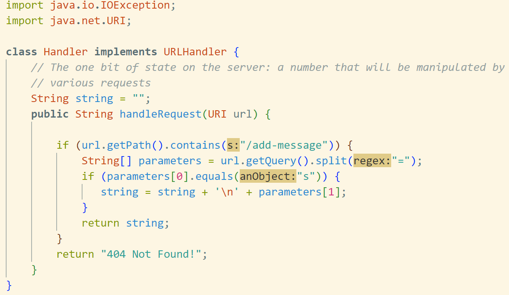
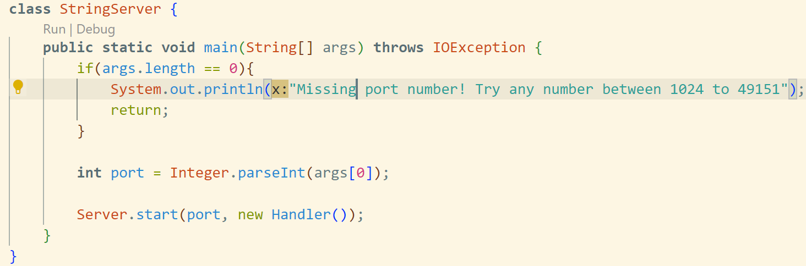
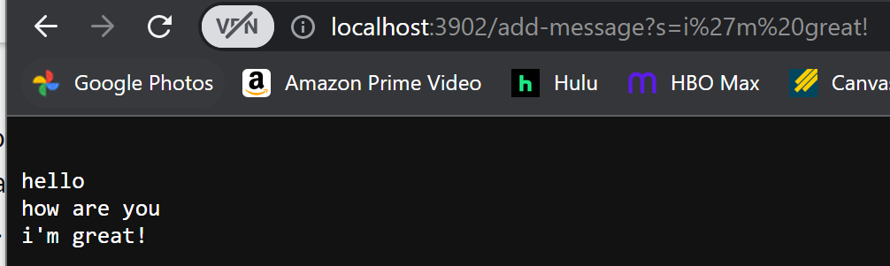
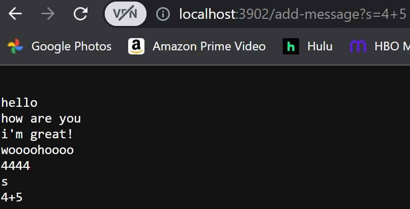

Hello, thank you for checking out my lab report 2!

Today, we will be showing you my String Server and a few lessons about bugs and symptoms!

# Part 1: Writing a web server

Below is the code for my String Server: 

- This is the code that tells our server what we want to happen. If the path of my url is "add-message", it will add the string I write in the next line. 

- This is the code that sets up the port for our server so you can access it on the web browser. 

- Methods in 

