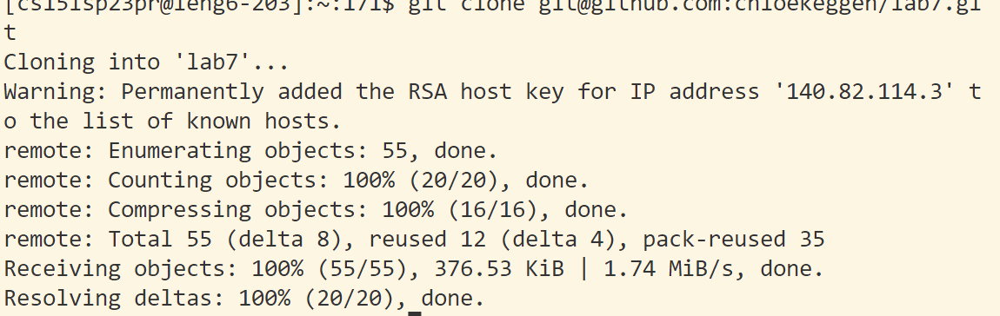
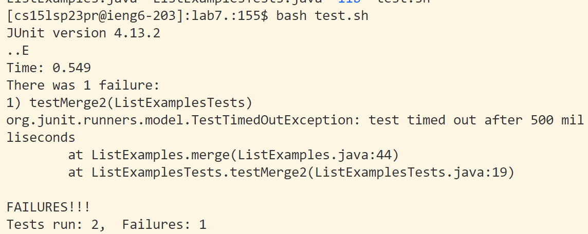
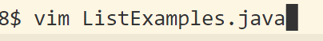
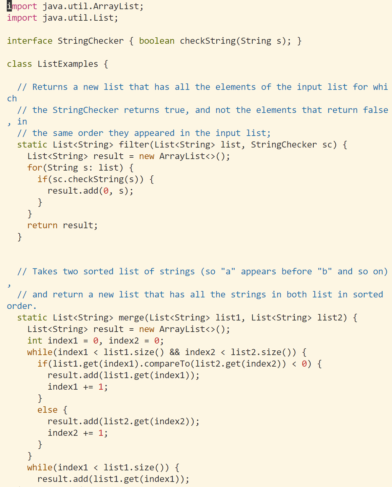
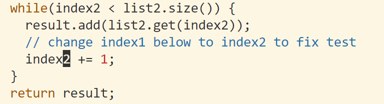
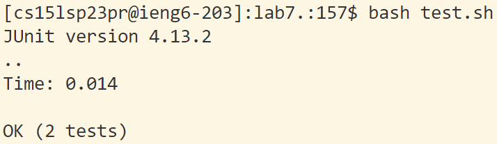

1. Log in and clone
`<ssh cs15l23pr@ieng.ucsd.edu> <enter>`

`<git clone https://github.com/chloekeggen/lab7.git><enter>
2. Run the tests

`<bash test.sh><enter>`
3. Edit the code

Change the `index1` to an `index2`

`</index1 +><enter><n><n><e><s><2><escape><:wq>`

4. Run tests again

