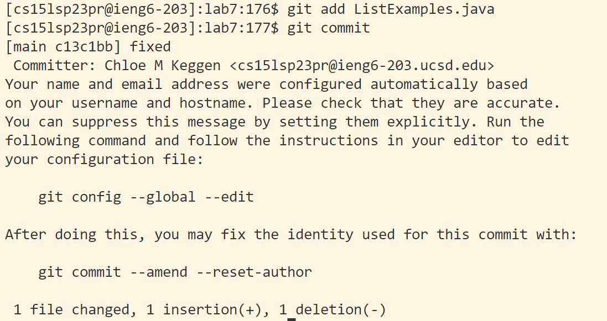
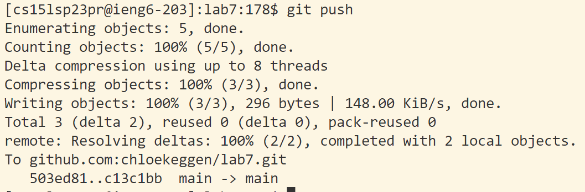

# LAB REPORT 4
1. Log in and clone

`<ssh cs15l23pr@ieng6.ucsd.edu> <enter>`
We are allowed to log in directly to ieng6 through our SSH key that we generated!

`<git clone https://github.com/chloekeggen/lab7.git><enter>`
`<cd lab7><enter>`

2. Run the tests

`<bash test.sh><enter>`

3. Edit the code

Change the `index1` to an `index2`

## `</index1 +><enter><n><n><e><s><2><escape><:wq>`

4. Run tests again

`<bash test.sh><enter>`

5. git commit and push

`<bash add ListExamples.java>`
`<bash commit>` 

`<bash push>` 

We are allowed to push directly to github through our SSH key that we generated! 
