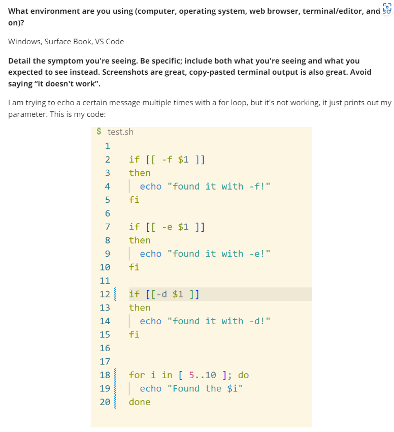
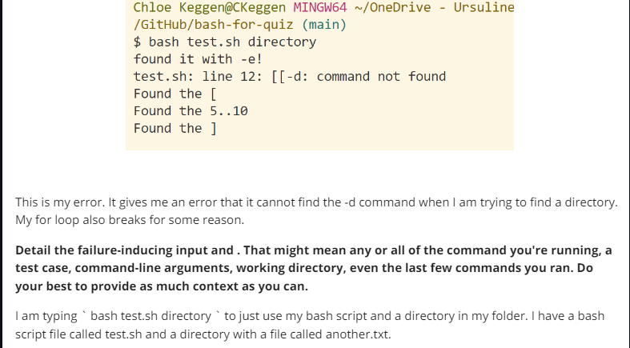
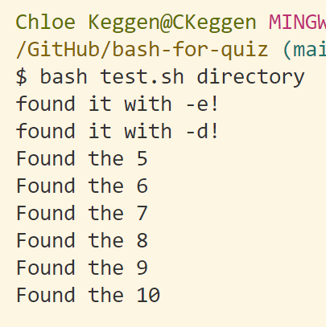
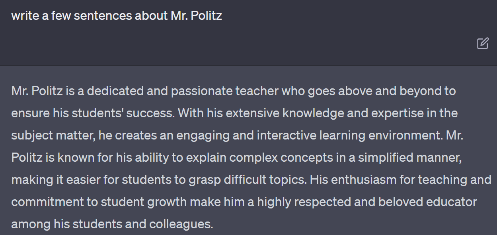

## Lab Report 5 

# TA Response

`Hey Chloe! You may have some syntax errors in your code that causes these errors! If you look at line 12, is the spacing up to the bash guidelines? You may be missing a space or have an extra space.
As for the for loop, everything looks good, but bash uses {} instead of []. If you change that, it should work properly. Hope this helps!`

# Reviewed Code

# Part Two

This is mostly to be silly, but one of the cool things I learned about was CHATGPT and AI! Being encouraged to use it during another lab report was interesting for me because it truly was helpful and efficient in giving me information! I like asking it to teach my about things, but I have noticed it is not 100% correct, but it is still a good tool. I also enjoyed the VIM tutorial during lab. I like that the tutorial is kind of built into the system!
