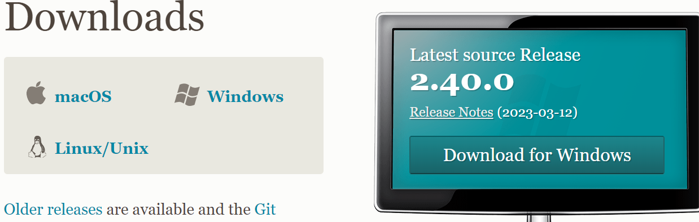

Hello, thank you for checking out my lab report!

Today, we will be going through how to download VS Code, connect to a remote server from the terminal, and run some commands!

# Create your class account
[How to change your in-class password](https://docs.google.com/document/d/1hs7CyQeh-MdUfM9uv99i8tqfneos6Y8bDU0uhn1wqho/edit)

In order to log on to the computers remotely, you need a special log-in. The professor has created an acocunt for you, but you need to change your password to log in. You can do that with the link above. It may take 10-15 minutes to work.

# Download VS Code


Go to this [website](https://code.visualstudio.com/) and download the latest VS Code. 

# Setting up environment

When finished downloading, open VS Code. In order to connect to remote servers, we need to use [Git](https://git-scm.com/downloads) 


**1. Download the latest version, and once downloaded, open VS Code and create a new terminal at the top. Now, open the command palette using `CTRL` + `Shift` + `P` .**

**2. Type "Select Default Profile"**

**3. Select "Git Bash"**

**4. Click on the + icon in the terminal window.**

**Now Git Bash should be set up as the default terminal!**

# Connect to remote server 


Type in 
```
ssh cs15lsp23abc@ieng6.ucsd.edu
```
**but replace abc with your own login.**

It will now ask for your password, so type in the one that you created [here](https://docs.google.com/document/d/1hs7CyQeh-MdUfM9uv99i8tqfneos6Y8bDU0uhn1wqho/edit)


Now you should be connected to the remote server, and it should resemble the image above! 

Try out some commands in your terminal to check what it does:
```
cd  : "change directory", use when you want to enter into a directory!
cd ~ : when you want to enter the home directory
ls -lat : lists files and directories 
ls -a
ls <directory> where <directory> is /home/linux/ieng6/cs15lsp23/cs15lsp23abc, 
            where the abc is one of the other group members’ username
cat /home/linux/ieng6/cs15lsp23/public/hello.txt : concatenates files and prints contents
```

Here is an example of what your terminal could look like!

```
[cs15lsp23pr@ieng6-202]:~:31$ pwd
/home/linux/ieng6/cs15lsp23/cs15lsp23pr
[cs15lsp23pr@ieng6-202]:~:32$ mkdirTestDir
bash: mkdirTestDir: command not found...
[cs15lsp23pr@ieng6-202]:~:33$ cd TestDir
-bash: cd: TestDir: No such file or directory
[cs15lsp23pr@ieng6-202]:~:34$ mkdir TestDir
[cs15lsp23pr@ieng6-202]:~:35$ cd TestDir
[cs15lsp23pr@ieng6-202]:TestDir:36$ cd ~
[cs15lsp23pr@ieng6-202]:~:37$ cd ~
[cs15lsp23pr@ieng6-202]:~:37$ ls -lat
total 132
drwxr-s---  10 cs15lsp23pr ieng6_cs15lsp23  4096 Apr 23 23:26 .
drwxr-s---   2 cs15lsp23pr ieng6_cs15lsp23  4096 Apr 23 23:26 TestDir
-rw-r--r--   1 cs15lsp23pr ieng6_cs15lsp23  1323 Apr 23 23:26 .modulesbegenv
-rw-r-----   1 cs15lsp23pr ieng6_cs15lsp23     0 Apr 23 23:26 .motd
drwxr-sr-x 509 cs15lsp23   ieng6_cs15lsp23 40960 Apr 13 01:17 ..
-rw-------   1 cs15lsp23pr ieng6_cs15lsp23   742 Apr 12 16:38 .bash_history
drwx--S---   2 cs15lsp23pr ieng6_cs15lsp23  4096 Apr 12 16:16 .ssh
drwxr-s---   3 cs15lsp23pr ieng6_cs15lsp23  4096 Apr 12 16:05 wavelet
drwxr-S---   3 cs15lsp23pr ieng6_cs15lsp23  4096 Apr 12 16:00 .pki
drwxr-sr-x   2 cs15lsp23pr ieng6_cs15lsp23  4096 Apr 12 15:58 perl5
drwxr-sr-x   3 cs15lsp23pr ieng6_cs15lsp23  4096 Apr 12 15:58 .local
drwxr-sr-x   3 cs15lsp23pr ieng6_cs15lsp23  4096 Apr 12 15:58 .config
drwxr-sr-x   3 cs15lsp23pr ieng6_cs15lsp23  4096 Apr 12 15:58 .cache
-rwxr-x---   1 cs15lsp23pr ieng6_cs15lsp23   290 Apr  5 17:12 .zshrc
-rwxr-x---   1 cs15lsp23pr ieng6_cs15lsp23   481 Apr  5 17:12 .zshenv
-rwxr-x---   1 cs15lsp23pr ieng6_cs15lsp23  1931 Apr  5 17:12 .zprofile
-rwxr-x---   1 cs15lsp23pr ieng6_cs15lsp23  1961 Apr  5 17:12 .profile
-rwxr-x---   1 cs15lsp23pr ieng6_cs15lsp23   837 Apr  5 17:12 .procmailrc
-rwxr-x---   1 cs15lsp23pr ieng6_cs15lsp23   431 Apr  5 17:12 .login
-rwxr-x---   1 cs15lsp23pr ieng6_cs15lsp23   155 Apr  5 17:12 .locallogin
-rwxr-x---   1 cs15lsp23pr ieng6_cs15lsp23  1692 Apr  5 17:12 .kshrc
-rwxr-x---   1 cs15lsp23pr ieng6_cs15lsp23  1931 Apr  5 17:12 .cshrc
-rwxr-x---   1 cs15lsp23pr ieng6_cs15lsp23  1721 Apr  5 17:12 .bashrc
-rwxr-x---   1 cs15lsp23pr ieng6_cs15lsp23   975 Apr  5 17:12 .bash_profile
```


# You are good to go! Have fun accessing your server!
