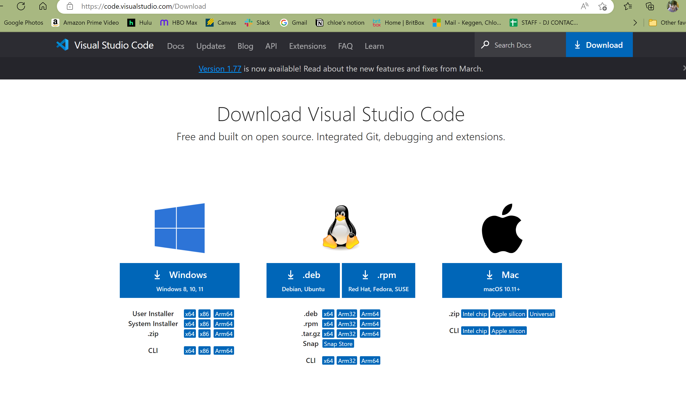
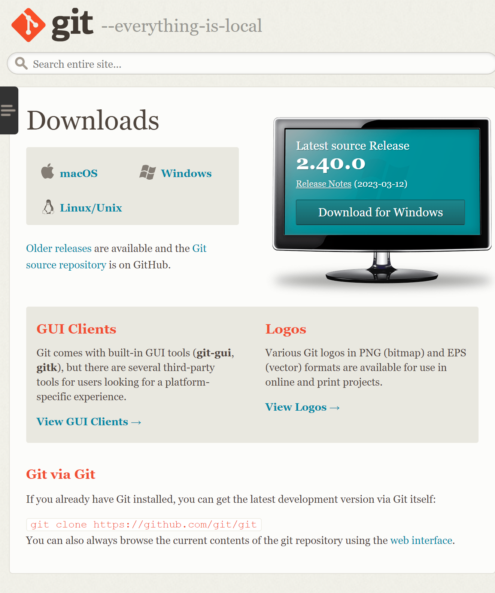
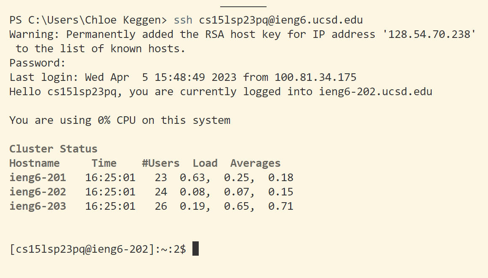

``` 
Hello, thank you for checking out my lab report!

Today, we will be going through how to download VS Code, connect to a remote server from the terminal, and run some commands!

```

# Download VS Code



Go to this [website](https://code.visualstudio.com/) and download the latest VS Code. 

# Setting up environment

When finished downloading, open VS Code. In order to connect to remote servers, we need to use [Git](https://git-scm.com/downloads) 


1. Download the latest version, and once downloaded, open VS Code and create a new terminal at the top. Now, open the command palette using `CTRL` + `Shift` + `P` . 

2. Type "Select Default Profile"
3. Select "Git Bash"
4. Click on the + icon in the terminal window. 

Now Git Bash should be set up as the default terminal!

# Connect to remote server 


Type in 
```
ssh cs15lsp23abc@ieng6.ucsd.edu
```
but replace abc with your own login. 
