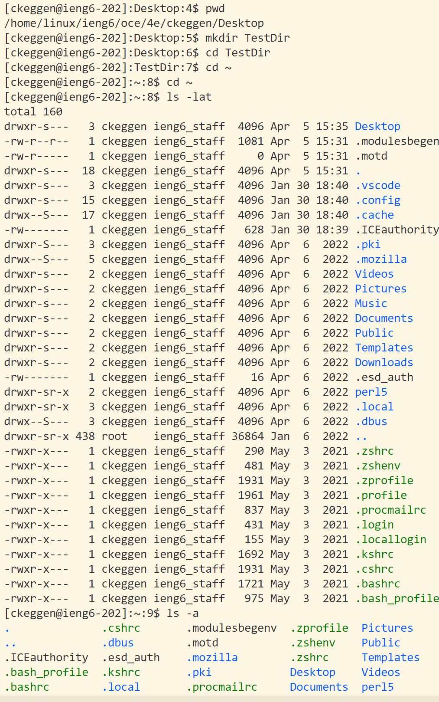

``` 
Hello, thank you for checking out my lab report!

Today, we will be going through how to download VS Code, connect to a remote server from the terminal, and run some commands!

```
# Create your class account
[How to change your in-class password](https://docs.google.com/document/d/1hs7CyQeh-MdUfM9uv99i8tqfneos6Y8bDU0uhn1wqho/edit)

In order to log on to the computers remotely, you need a special log-in. The professor has created an acocunt for you, but you need to change your password to log in. You can do that with the link above. It may take 10-15 minutes to work.

# Download VS Code


Go to this [website](https://code.visualstudio.com/) and download the latest VS Code. 

# Setting up environment

When finished downloading, open VS Code. In order to connect to remote servers, we need to use [Git](https://git-scm.com/downloads) 


**1. Download the latest version, and once downloaded, open VS Code and create a new terminal at the top. Now, open the command palette using `CTRL` + `Shift` + `P` .**
**2. Type "Select Default Profile"**
**3. Select "Git Bash"**
**4. Click on the + icon in the terminal window.**

**Now Git Bash should be set up as the default terminal!

# Connect to remote server 


Type in 
```
ssh cs15lsp23abc@ieng6.ucsd.edu
```
**but replace abc with your own login.**

It will now ask for your password, so type in the one that you created [here](https://docs.google.com/document/d/1hs7CyQeh-MdUfM9uv99i8tqfneos6Y8bDU0uhn1wqho/edit)

Now you should be connected to the remote server, and it should resemble the image above! 

Try out some commands in your terminal to check what it does:
```
cd ~
cd
ls -lat
ls -a
ls <directory> where <directory> is /home/linux/ieng6/cs15lsp23/cs15lsp23abc, where the abc is one of the other group members’ username
```




# You are good to go! Have fun accessing your server!
